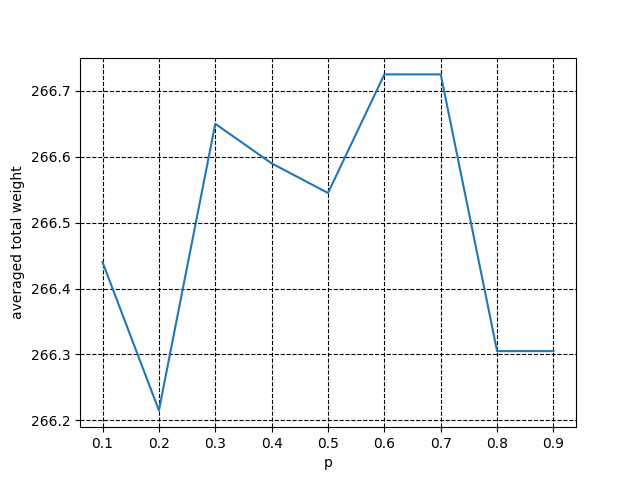
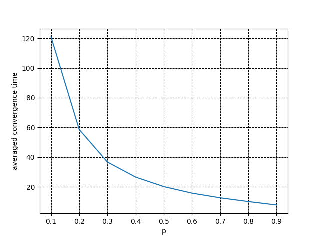
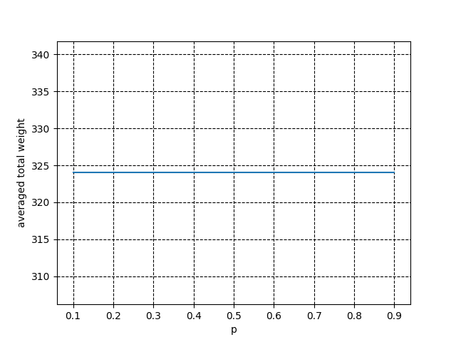

# Report

## Question (a)
This is a sequel of HW2b. We inherit the same assumption (anonymous algorithm plus randomized
initial values; M1 plus M2) and the same decision making rule. However, we no longer assume
that program executions are synchronized in a round basis. Instead, we consider a different
execution model (called it Model 1) that allows only one process to make a decision at a time (in
each round). Which process has the right to make its decision is purely stochastic. However, to
make Model 1 fair, we assume that all processes have the probability to get the right. The
simulation ends when no process will change its decision any longer. Call the new program HW3a.
Run HW3a 1,000 times, each with different randomized initial values, on the same input data file
and answer the following questions.
1. Is it possible that HW3a does not stop for some input? Why?
2. If HW3a does stop for some input file, please list all possible results (one line for each set of
duplicated results) with respective percentages. Are all these results correct (independent sets)?

```sh
$ ./HW3a.py < test1.txt | sort | uniq -c
472 [0, 3, 4, 5, 7, 8]
528 [1, 4, 5, 7, 8, 9]
$ ./HW3a.py < test1.txt | sort | uniq -c
508 [0, 3, 4, 5, 7, 8]
492 [1, 4, 5, 7, 8, 9]
$ ./HW3a.py < test1.txt | sort | uniq -c
501 [0, 3, 4, 5, 7, 8]
499 [1, 4, 5, 7, 8, 9]
$ ./HW3a.py < test2.txt | sort | uniq -c
1000 [4, 5, 6, 8]
```

According to the test, test1.txt will generate 2 correct MWIS with 50% for each, test2.txt
will generate 1 correct MWIS with 100% probability.

## Question (b)
The same as (a) but we consider another execution model called Model 2. It allows an arbitrary
number of processes to make decisions in a single round. The number of processes that get the
right to make decisions is random. We also assume that each process has the same probability p to
get the right. This model actually subsumes Model 1 and the original synchronized model. The
simulation ends when no process will change its decision any longer. Call the new program HW3b.
Run HW3b 1,000 times, each with different randomized initial values, on the same input data file
and answer the following questions.
1. Is it possible that HW3b does not stop for some input? Why?
2. If HW3b does stop for some input file, please list all possible results (one line for each set of
duplicated results) with respective percentages. Are all these results correct (independent sets)?

```sh
$ ./HW3b.py < test1.txt | sort | uniq -c
494 [0, 3, 4, 5, 7, 8]
506 [1, 4, 5, 7, 8, 9]
$ ./HW3b.py < test1.txt | sort | uniq -c
509 [0, 3, 4, 5, 7, 8]
491 [1, 4, 5, 7, 8, 9]
$ ./HW3b.py < test1.txt | sort | uniq -c
519 [0, 3, 4, 5, 7, 8]
481 [1, 4, 5, 7, 8, 9]
$ ./HW3b.py < test2.txt | sort | uniq -c
1000 [4, 5, 6, 8]
```
According to the test, test1.txt will generate 2 correct MWIS with 50% for each, test2.txt
will generate 1 correct MWIS with 100% probability, the result isn't affected by probability p.

## Question (c)
Consider two performance matrices:
1. averaged total weight (in the set) and
2. averaged convergence time (the number of rounds to the end of the simulations).
Change the value of p in (b) from 0.1 to 0.9 (with step 0.1) and run HW3b 1,000 times on the same input data file for each possible setting of p.
Collect the statistics. (a) Use a x-y graph to show (1) how changes with the setting of p. (b) Use a x-y graph to show how (2) changes with the setting of p.

### Test1.txt

#### Averaged total weight

#### Averaged convergence time

### Test2.txt

#### Averaged total weight

#### Averaged convergence time

